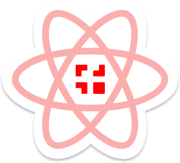

**Koobiq React** is an open-source React component library. 
It's comprehensive and can be used in production out of the box.

## 🚀 Getting Started

Here are a few helpful links for getting started with Koobiq React:

- [Documentation](https://react.koobiq.io/?path=/docs/welcome--docs) — learn how to use Koobiq React and view the components in Storybook.
- [Icons](https://react.koobiq.io/?path=/docs/icons--docs) — explore available icons in the Koobiq React icons library.

## 📦 Packages

- [@koobiq/react-components](https://github.com/koobiq/react-components/tree/main/packages/components) — the React component library.
- [@koobiq/react-primitives](https://github.com/koobiq/react-components/tree/main/packages/primitives) — a collection of unstyled React-components and behavior hooks.
- [@koobiq/react-icons](https://github.com/koobiq/icons) — a collection of React-icons (maintained in the [koobiq/icons](https://github.com/koobiq/icons) repository).
- [@koobiq/react-core](https://github.com/koobiq/react-components/tree/main/packages/core) — common utilities and hooks used by Koobiq React packages.
- [@koobiq/logger](https://github.com/koobiq/react-components/tree/main/packages/logger) — the utilities for displaying the log on the client side.

## 🤖 AI tools

- [Claude Code plugin](https://react.koobiq.io/?path=/docs/ai-claude-code-plugin--docs) — reviews product code against the design system, helps upgrade Koobiq React and installs a lint preset. Install it in Claude Code with `/plugin marketplace add koobiq/react-components`, then `/plugin install koobiq@koobiq-react`.
- [LLMs.txt](https://react.koobiq.io/?path=/docs/ai-llms-txt--docs) — the documentation in a form AI tools can read.
